&nbsp;
&nbsp;

 

<!-- ═══════════════════════ ABOUT + STATS ═══════════════════════ -->

<table>
<tr>
<td width="55%" valign="top">

### About Me

I build software at the intersection of **AI, cybersecurity, and real-world systems**. I work across the full stack — from low-level C and systems programming to production TypeScript and cloud infrastructure.

**Currently:**

- Founder of **[The Foundry](https://github.com/muhammadrashid4587/foundry)** — empowering builders and young founders
- Organizing **[Dragonhacks 2026](https://github.com/muhammadrashid4587/Dragonhacks2026)** — a hackathon for the next generation
- Studying **Computer Science** — systems, AI/ML, and security
- Building **[MANTICORE](https://github.com/muhammadrashid4587/projectmanticore)** — AI-driven cyber-defense

 

### Tech Stack

**Languages**
 

**AI / ML**
 

**Backend**
 

**Frontend**
 

**Mobile**
 

**Infrastructure**
 

</td>
<td width="45%" valign="top">

### At a Glance

 

 

</td>
</tr>
</table>

 

<!-- ═══════════════════════════════ PROJECTS ═══════════════════════════════ -->

### Featured Projects

 

&nbsp;

&nbsp;

&nbsp;

 

<!-- ═══════════════════════════ FOOTER ═══════════════════════════ -->

 

  

<a href="https://next.ossinsight.io/widgets/official/compose-user-dashboard-stats?user_id=125306893" target="_blank">
<picture>
<source media="(prefers-color-scheme: dark)" srcset="https://next.ossinsight.io/widgets/official/compose-user-dashboard-stats/thumbnail.png?user_id=125306893&image_size=auto&color_scheme=dark" width="100%">

</picture>
</a>

  

 

