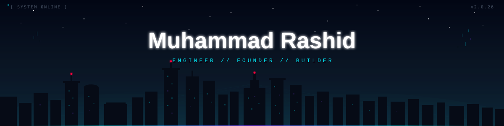

<p align="center">

</p>

<p align="center">
<a href="https://linkedin.com/in/muhammadrashid4587"></a>&nbsp;
<a href="mailto:muhammadrashid4587@gmail.com"></a>
</p>

<br/>

I'm a **Computer Science student** who builds the unglamorous layer under AI systems: the protocol servers, the cloud pipelines, and the guardrails that decide what an agent is allowed to do.

Primarily **Python**, plus **AWS** with real infrastructure as code. I care about the parts that are easy to claim and hard to prove — so every project below ships tests that check the claim, and every number in this README came from a command you can run yourself.

<p align="center"></p>

## What I've shipped

<table>
<tr>
<td width="50%" valign="top">

### 🔌 [mcp-schema-sentinel](https://github.com/muhammadrashid4587/mcp-schema-sentinel)

**A read-only MCP server that Claude and Cursor can't be talked into writing with.**

The JSON-RPC 2.0 stdio transport is implemented from scratch — no SDK, zero dependencies. The SQL guard is an allowlist, not a blocklist, because a blocklist loses to `DR/**/OP`.

`165 tests` · `31 bypass techniques blocked` · `p50 0.16 ms/call`

`Python` `MCP` `JSON-RPC` `SQLite`

</td>
<td width="50%" valign="top">

### ☁️ [aws-docforge](https://github.com/muhammadrashid4587/aws-docforge)

**S3 → SQS → Lambda → Bedrock document pipeline that runs with no AWS account.**

PII redaction happens *before* the model call and is enforced by an assertion, not a comment. IAM least-privilege isn't a README claim — 24 tests parse the template and fail CI on any wildcard.

`77 tests` · `SAM + Terraform` · `zero-credential demo`

`AWS` `Lambda` `Terraform` `Bedrock` `moto`

</td>
</tr>
<tr>
<td width="50%" valign="top">

### 🛡️ [toolshield](https://github.com/muhammadrashid4587/toolshield)

**Guardrails between an agent deciding to act and acting.**

Schema, path containment, command risk, and indirect prompt-injection detection. Three verdicts, not two — ambiguous actions go to a human instead of being forced into allow or deny.

`185 tests` · `precision 1.000 / recall 0.950` · `79-doc corpus`

`Python` `AI security` `prompt injection`

</td>
<td width="50%" valign="top">

### 📓 [lab](https://github.com/muhammadrashid4587/lab)

**A daily practice that refuses to fake a commit.**

Five layered checks block date spoofing, headless runs, placeholder notes, and empty diffs. An AST test proves no git call site can pass `--allow-empty` or `--date`.

`34 tests` · `no contribution bots` · `12-week plan as code`

`Python` `tooling` `git`

</td>
</tr>
</table>

<p align="center"></p>

## How this fits together

These aren't four unrelated repos — they're one system, built in the order you'd actually need them.

```
    ┌──────────────────────────────────────────────────────────────┐
    │  AGENTS & MCP                                                │
    │  mcp-schema-sentinel — MCP wire protocol from scratch,       │
    │  five read-only tools, deterministic schema audit            │
    └───────────────────────────┬──────────────────────────────────┘
                                │ validates its tool arguments with
                                ▼
    ┌──────────────────────────────────────────────────────────────┐
    │  DEFENSIVE AI SECURITY                                       │
    │  toolshield — schema · path containment · command risk ·     │
    │  indirect prompt injection.  No model in the loop.           │
    └───────────────────────────┬──────────────────────────────────┘
                                │ same redact-before-inference stance as
                                ▼
    ┌──────────────────────────────────────────────────────────────┐
    │  AWS CLOUD                                                   │
    │  aws-docforge — event-driven pipeline, least-privilege IaC,  │
    │  policy-as-code tests, runnable entirely on mocks            │
    └───────────────────────────┬──────────────────────────────────┘
                                │ built one real commit at a time via
                                ▼
    ┌──────────────────────────────────────────────────────────────┐
    │  PRACTICE                                                    │
    │  lab — the daily loop, and the checks that keep it honest    │
    └──────────────────────────────────────────────────────────────┘
```

**461 tests across the four**, weighted toward the cases that would actually cause harm: 31 SQL-guard bypasses, a byte-identical file check after every attempted write, a leak check that reads back every object written to S3, and a labelled corpus with published precision and recall.

Every README has a **"what I would fix next"** section naming real limitations, and known detector misses are encoded as `xfail` tests — so a silent regression shows up as a failure instead of a convenience.

<p align="center"></p>

## Open source contributions

Patches to other people's codebases — reading unfamiliar code, matching its conventions, and getting a change through review.

| Repo | What I did | PR | Status |
|------|-----------|-----|--------|
| `aden-hive/hive` | Graph validation for edge IDs, self-loops, and conditions | [#6154](https://github.com/aden-hive/hive/pull/6154) | Closed |
| `Gustav-Proxi/agentreplay` | Single-node + stats API endpoints, with tests | [#17](https://github.com/Gustav-Proxi/agentreplay/pull/17) | Open |
| `wook95/ngx-recharts` | Fixed shape components, unified polar angle math | [#16](https://github.com/wook95/ngx-recharts/pull/16) | Closed |
| `ioflux-org/studio-json-schema` | YAML node-click highlighting in the Monaco editor | [#176](https://github.com/ioflux-org/studio-json-schema/pull/176) | Closed |
| `RetricSu/fiber-pay` | Replaced blocking `appendFileSync` with an async `WriteStream` | [#75](https://github.com/RetricSu/fiber-pay/pull/75) | Closed |
| `msutara/config-manager-web` | Fixed hidden job history on fresh installs | [#42](https://github.com/msutara/config-manager-web/pull/42) | Closed |

<p align="center"></p>

## Also building

Work that lives in private or team repos, described here rather than linked so you don't hit a 404:

- **MANTICORE** — AI-driven cyber-*defence* sentinel. Detection and response, not offence.
- **The Foundry** — founder. A community for student builders and young founders.
- **Dragonhacks 2026** — organizer.
- **ARES** · **DroneDash** — TypeScript and Python systems work.

Happy to walk through any of these, or share access, on request.

<p align="center"></p>

## Stack

Things I'd be comfortable being interviewed on, not everything I've touched.

**Core** &nbsp;


**Cloud & infra** &nbsp;


**AI systems** &nbsp;


**Practice** &nbsp;


Every flagship pins its GitHub Actions to full commit SHAs, runs `bandit` and `pip-audit`, and publishes an OpenSSF Scorecard. Two of them have zero runtime dependencies and prove it in CI.

<p align="center"></p>

<div align="center">


<br/><br/>

**Looking for:** SWE internships and new-grad roles — backend, cloud, AI infrastructure, or security engineering.

</div>

<p align="center">

</p>
